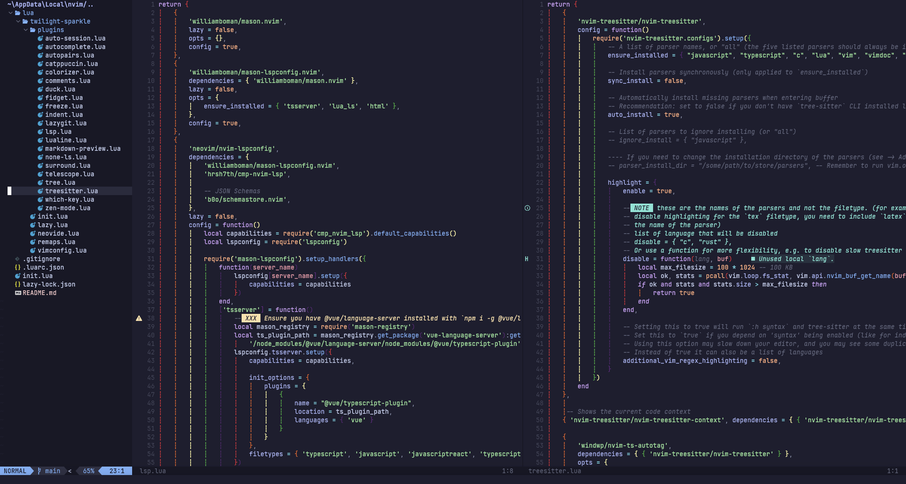

# cow.nvim



## Pre-requisites

- [Neovim](https://neovim.io) v0.10.0

- JetbrainsMono [Nerd Font](https://www.nerdfonts.com) (10)

- [freeze](https://github.com/charmbracelet/freeze)

- [ripgrep](https://github.com/BurntSushi/ripgrep)

- [neovide](https://neovide.dev) (Optional)

## Installation

```bash
$ git clone https://github.com/Jaezmien/.nvim.git ~/.config/nvim
```
