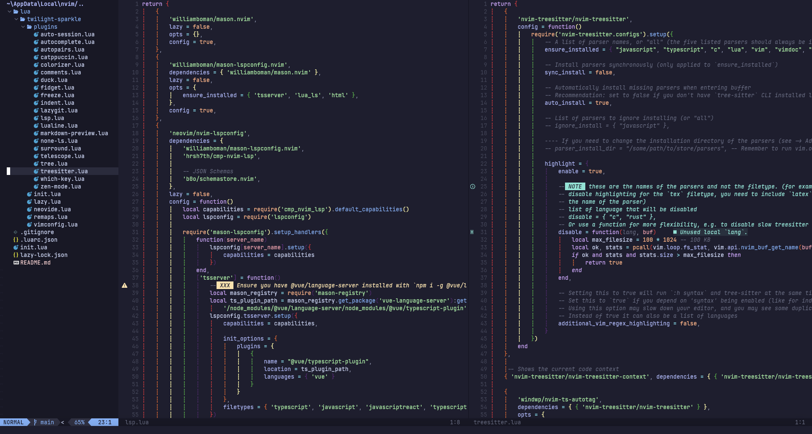

# cow.nvim



## Pre-requisites

- [Neovim](https://neovim.io) v0.11.3
- JetbrainsMono [Nerd Font](https://www.nerdfonts.com) (10)
- [ripgrep](https://github.com/BurntSushi/ripgrep)
- [tree-sitter-cli](https://github.com/tree-sitter/tree-sitter)
- [neovide](https://neovide.dev) (Optional)

## Installation

```bash
$ git clone https://github.com/Jaezmien/.nvim.git ~/.config/nvim
```

## Post-Installation

- Check [nvim-treesitter](https://github.com/nvim-treesitter/nvim-treesitter) for further configuration.
